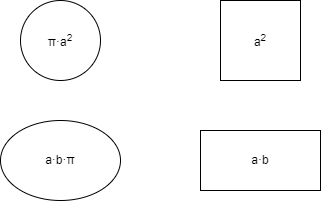

# Example

Welcome to the document! This is an example markdown file. It's intended to be a placeholder to illustrate what it looks like when you view a markdown file in a GitHub respository through the GitHub Web UI.

## Shapes!

Here are some sample shapes and formulas. Really, they're just here to demonstrate one way of including a diagram with markdown.

